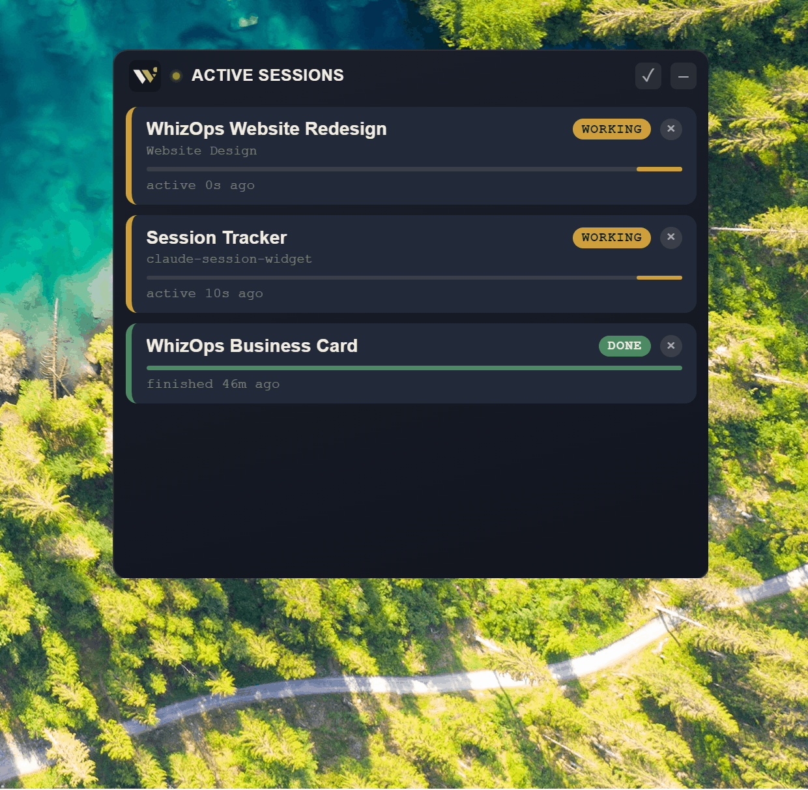

# Claude Code Lookout

A Claude Code **skill** that builds you a small always-on-top desktop widget
watching every active Claude Code session at once — Working, Needs You, or
Done — with a real desktop toast notification the moment one needs attention.

No more tabbing through half a dozen terminals or VS Code tabs to find out
which session is stuck waiting on you.

## What makes this different

This isn't a binary you download and trust. It's a **build recipe**: install
the skill, ask Claude Code to build it, and it constructs a fresh, fully
readable copy of the tool directly in your own environment — same source you
can see right here in `SKILL.md`.

It's also not a passive status display. Most similar tools show status if you
happen to glance at a menu bar icon. This one actively pops a toast the moment
something needs you, and specifically tells the difference between "still
working," "waiting on a permission prompt," "asking a clarifying question,"
and "done" — the middle two are easy to miss with hooks alone; several
existing tools in this space don't distinguish them.

## Install

1. Clone this repo into your Claude Code skills folder:
   ```
   git clone https://github.com/whizopsllc-eng/claude-code-lookout.git ~/.claude/skills/claude-code-lookout
   ```
   (On Windows: `%USERPROFILE%\.claude\skills\claude-code-lookout`)
2. In a Claude Code session, just ask: *"build me a session tracker like
   claude-code-lookout"* — or reference the skill directly. Claude Code will
   follow `SKILL.md` to scaffold the Electron app and wire up the hooks.

Claude Code will pause before editing your global `~/.claude/settings.json`
(the hooks it adds apply to every project on the machine) — confirm that step
when asked.

## What it looks like

A small floating card list, one per active session, color-coded by status,
plus a toast notification that slides in bottom-right when a session needs
you or finishes.



## Requirements

- Node.js + npm
- Windows: built and extensively tested here, including a from-scratch dry
  run following only this skill.
- macOS: confirmed working by a user following this skill directly. The
  silent-launcher step (`start-widget.vbs`) is Windows-only and needs a
  macOS equivalent (a `.command` file or LaunchAgent) — see `SKILL.md`.
- Linux: architecturally should work (same cross-platform Electron code) but
  not yet confirmed by anyone — if you try it, let us know.

## Why this exists

I kept losing track of which of my several parallel Claude Code sessions
actually needed me. So I built this by just describing what I wanted to
Claude Code itself, iterating out loud every time something didn't work. This
repo is the result, packaged so anyone else can get Claude to build them the
same thing.

## License

MIT — see [LICENSE](LICENSE).
